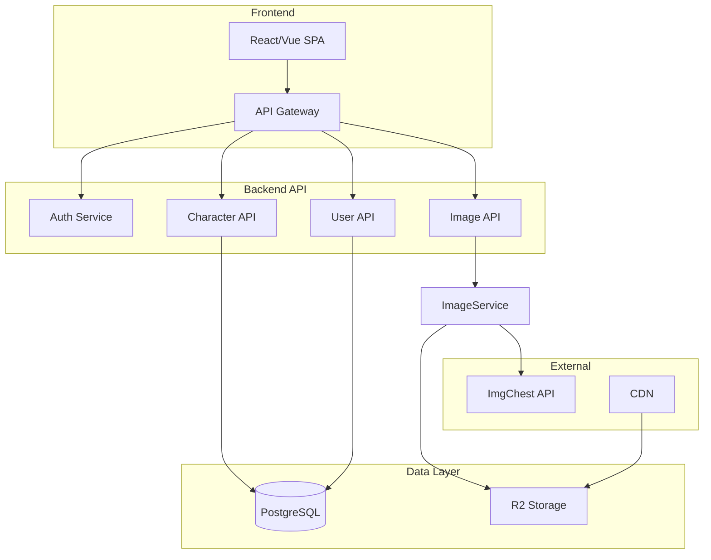

# Ideal Architecture for CustomImageManager

## Current State Summary

The app is a **Mudae character image manager**: search characters, save bookmarks, upload/reorder custom images, generate $ai commands. It uses Flask, JSON/PostgreSQL, ImgChest for hosting, and optional GitHub sync for master data.

**Critical issues identified:**

- ImgChest API key hardcoded in [imgchest_utils.py](imgchest_utils.py) (line 4) — security risk
- `update_github_file` used but not imported in [upload_imgchest.py](upload_imgchest.py) — GitHub sync broken
- Dual data sources (CSV + JSON + DB) with inconsistent semantics
- No authentication — single shared state
- Master data (CharName.csv, character_image_mapping.json) on ephemeral filesystem — lost on redeploy unless GitHub sync works
- 2,300+ line monolithic [app.js](app.js) — hard to maintain

---

## Architecture: How It Should Be Built

---

## 1. Data Model (Complete Rework)

**Current:** CSV + JSON + DB with overlapping concerns. Character list lives in CSV; main images in mapping JSON; custom images in DB.

**Ideal:** Single source of truth in PostgreSQL.

| Table              | Purpose                                                        |
| ------------------ | -------------------------------------------------------------- |
| `characters`       | id, name, series, rank, main_image_url, created_at, updated_at |
| `custom_images`    | id, character_id, url, position, created_at                    |
| `users`            | id, name, email, provider (if multi-user)                      |
| `saved_characters` | user_id, character_id, saved_at (if multi-user)                |
| `last_updated`     | character_id, updated_at (or denormalize on characters)        |

**Migration:** CharName.csv and character_image_mapping.json become one-time import. All edits go through the API and DB.

---

## 2. Tech Stack

| Layer             | Current                    | Ideal                                                |
| ----------------- | -------------------------- | ---------------------------------------------------- |
| **Frontend**      | Vanilla JS, 2.3k lines     | React or Vue — components, state management, routing |
| **Backend**       | Flask                      | FastAPI or Flask — REST API only, no HTML serving    |
| **API style**     | Mixed (HTML + JSON)        | Pure REST or GraphQL                                 |
| **DB**            | PostgreSQL + JSON fallback | PostgreSQL only (no JSON fallback in prod)           |
| **Image storage** | ImgChest only              | ImgChest + optional R2/S3 for backups or CDN         |
| **Auth**          | None                       | Optional: OAuth (Discord, Google) for multi-user     |

---

## 3. Services and Hosting

| Service           | Recommendation                                                                                    |
| ----------------- | ------------------------------------------------------------------------------------------------- |
| **App hosting**   | **DigitalOcean App Platform** or **Railway** — keep Python + Flask/FastAPI, simple deploy         |
| **Database**      | **DigitalOcean Managed PostgreSQL** or **Neon** (serverless Postgres)                             |
| **Image hosting** | **ImgChest** — keep it; fits Mudae. Add **Cloudflare R2** or **DO Spaces** as optional backup/CDN |
| **CDN**           | **Cloudflare** in front — DNS, DDoS, caching for static assets                                    |
| **GitHub**        | **Remove** — no file sync. Master data lives in DB. Use GitHub only for code and CI/CD            |

---

## 4. Logic Changes

### 4.1 Remove GitHub Sync Entirely

- **Why:** File-based sync is unreliable, causes conflicts, and slows writes.
- **Replace with:** DB as source of truth. One-time CSV/JSON import if needed.

### 4.2 Single Source for Character Data

- **Current:** CharName.csv + character_image_mapping.json + custom_images in DB.
- **Ideal:** All character data in `characters` table. `main_image_url` column. Custom images in `custom_images` table with `character_id` FK.

### 4.3 Image Upload Flow

- **Current:** Upload → Flask → Pillow convert → ImgChest → store URL.
- **Ideal:** Same flow, but:
  - Move conversion to a **separate worker** (Celery, background job) if uploads are slow or blocking.
  - Or: **Client-side resize** (browser-image-compression) before upload to reduce server load.
  - Keep Pillow for server-side conversion when needed.

### 4.4 API Key and Secrets

- **Current:** Hardcoded in [imgchest_utils.py](imgchest_utils.py).
- **Ideal:** `IMGCHEST_API_KEY` from environment. Use platform secrets (DO, Railway) or a secrets manager.

### 4.5 Frontend Structure

- **Current:** Monolithic app.js, hash routing, manual DOM manipulation.
- **Ideal:** Component-based (React/Vue), proper routing (React Router), centralized state (e.g. Zustand). Split by feature: search, character detail, saved list, custom images, etc.

### 4.6 Remove generate_mapping.py

- **Current:** Manual step to regenerate character_mapping.js from JSON.
- **Ideal:** No static file. Character data comes from API (`GET /api/characters`). No build step.

---

## 5. Security

| Issue               | Fix                                                                                   |
| ------------------- | ------------------------------------------------------------------------------------- |
| **API key in code** | Env var only; never commit                                                            |
| **No auth**         | Add optional Discord OAuth for multi-user; or keep single-user with API key for admin |
| **CORS**            | Explicit allowlist for production domain                                              |
| **Rate limiting**   | Add per-IP / per-user limits on upload and API endpoints                              |

---

## 6. Deployment

**Recommended setup:**

1. **DigitalOcean App Platform** — app + PostgreSQL
2. **Cloudflare** — DNS, proxy, CDN for static assets
3. **Env vars:** `DATABASE_URL`, `IMGCHEST_API_KEY`, optionally `GITHUB_TOKEN` and `GITHUB_REPO` only if you keep a read-only backup to GitHub (not for live sync)

---

## 7. Migration Path (If Rewriting)

**Phase 1 (low risk):**

- Move ImgChest key to env
- Fix GitHub import
- Consolidate master data into DB (one-time import from CSV/JSON)

**Phase 2 (medium):**

- Add proper REST API for characters
- Remove CSV/JSON from runtime; serve from DB only

**Phase 3 (larger):**

- Rewrite frontend in React/Vue
- Add optional auth
- Add background job queue for heavy image processing

---

## Summary: One-Sentence Recommendation

**Keep DigitalOcean + PostgreSQL, remove GitHub sync, consolidate all data into the database, move secrets to env vars, and add Cloudflare in front.** A full frontend rewrite to React/Vue is optional but improves maintainability long-term.