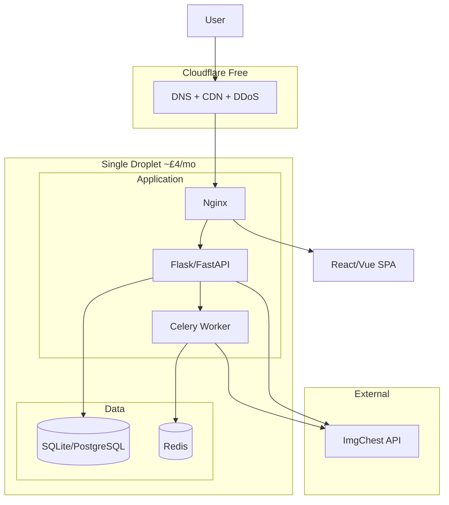

# Ideal Architecture for CustomImageManager — Version 2

**Budget:** £5/month | **Effort:** Ignored | **Goal:** Feature-complete ideal within budget

---

## Budget Allocation


| Component | Choice                                 | Monthly Cost |
| --------- | -------------------------------------- | ------------ |
| Hosting   | Single DigitalOcean Droplet            | ~£4          |
| Database  | SQLite or PostgreSQL (on same Droplet) | £0           |
| Frontend  | React or Vue                           | £0           |
| Auth      | Discord OAuth                          | £0           |
| Job queue | Celery + Redis (on same Droplet)       | £0           |
| CDN/DNS   | Cloudflare (free tier)                 | £0           |
| Images    | ImgChest                               | £0           |
| Domain    | Optional                               | £0–1         |
| **Total** |                                        | **~£4–5**    |


---

## Component Descriptions (Detailed)

### Hosting: DigitalOcean Droplet

**What it is:** A virtual private server (VPS)—a Linux machine you rent by the month. You get root access and full control over the OS and installed software.

**Used for:** Running the entire application stack: web server, Python app, database, Redis, and Celery workers. Everything lives on one machine.

**Why picked:** DigitalOcean offers predictable pricing, simple setup, and good documentation. A basic Droplet at $4–6/month fits the budget while providing enough resources for a small-to-medium app.

**Why optimal:** App Platform + managed PostgreSQL would cost ~£10–15/month. A single Droplet consolidates all services at ~£4, leaving headroom for domain or scaling later. Self-hosting on one box is the most cost-efficient way to run a full stack within £5.

---

### Database: SQLite or PostgreSQL

**What it is:** SQLite is a file-based, serverless database. PostgreSQL is a full client-server RDBMS. Both store structured data (characters, images, users) in tables.

**Used for:** Single source of truth for characters, custom images, users, and saved bookmarks. Replaces the current mix of CSV, JSON, and DB.

**Why picked:** SQLite requires zero setup—no separate process, no connection string beyond a file path. PostgreSQL offers better concurrency and features if the Droplet has enough RAM (1GB+). Both run on the same Droplet at no extra cost.

**Why optimal:** Managed PostgreSQL (Neon, DO Managed DB) adds £5–15/month. Self-hosted SQLite/PostgreSQL on the Droplet costs £0. For a Mudae image manager with moderate traffic, either is sufficient. SQLite is simpler; PostgreSQL is preferable if you expect multiple concurrent writers or future scaling.

---

### Frontend: React or Vue

**What it is:** Component-based JavaScript frameworks for building single-page applications (SPAs). React (Meta) and Vue (community) both use a virtual DOM, component composition, and ecosystem tooling.

**Used for:** Replacing the monolithic 2,300-line app.js with a structured UI: search, character detail, saved list, custom image management, upload flow. Components are reusable and testable.

**Why picked:** Both are mature, widely used, and have strong ecosystems. React has more jobs/tutorials; Vue is often cited as easier to learn. Either fits the budget (no licensing cost).

**Why optimal:** Vanilla JS at 2.3k lines is hard to maintain. React/Vue provide clear structure, state management (Zustand/Pinia), and routing (React Router/Vue Router). A proper SPA improves long-term maintainability and developer experience without adding hosting cost.

---

### Auth: Discord OAuth

**What it is:** OAuth 2.0 flow where users sign in with their Discord account. Discord provides an identity (user ID, username, avatar) after the user authorizes the app.

**Used for:** Identifying users so each person has their own saved characters and custom images. Replaces the current single shared state with per-user data.

**Why picked:** The app is a Mudae character manager—users are likely Discord users. Discord OAuth is free, well-documented, and requires no email verification or password storage.

**Why optimal:** Google/GitHub OAuth would work too, but Discord aligns with the target audience. No auth means shared state and no personalization; Discord OAuth adds user identity at zero cost and minimal complexity.

---

### Job Queue: Celery + Redis

**What it is:** Celery is a distributed task queue for Python. Redis is an in-memory store used as the message broker (and optionally result backend). Workers pull tasks from the queue and execute them asynchronously.

**Used for:** Offloading image conversion (Pillow resize/convert) and ImgChest upload from the HTTP request. The API enqueues a task, returns a job ID, and the worker processes it in the background.

**Why picked:** Celery is the standard Python solution for background jobs. Redis is lightweight (~10–50MB RAM) and doubles as a session store if needed. Both run on the same Droplet.

**Why optimal:** Image conversion can take seconds. Doing it in the request leads to timeouts (504) and poor UX. Celery + Redis moves work off the request path. Running Redis on the Droplet adds no cost; managed queues (e.g. Redis Cloud) would add £5+/month.

---

### CDN/DNS: Cloudflare (Free Tier)

**What it is:** Cloudflare sits between users and your server. It provides DNS management, DDoS protection, SSL termination, and optional caching for static assets.

**Used for:** DNS for your domain, HTTPS via Cloudflare’s certificates, protection against basic attacks, and caching of JS/CSS/images to reduce load on the Droplet.

**Why picked:** Free tier includes unlimited DNS, basic DDoS mitigation, and SSL. No credit card required for core features.

**Why optimal:** Without Cloudflare, you’d need to manage SSL yourself (Let’s Encrypt + cert renewal) and have no built-in DDoS protection. Cloudflare adds security and performance at £0. Essential for any production deployment.

---

### Images: ImgChest

**What it is:** An image hosting service with an API. Supports upload, returns URLs. Commonly used for Mudae and similar Discord bots.

**Used for:** Storing custom character images. The app uploads converted images to ImgChest and stores the returned URL in the database.

**Why picked:** Already integrated in the current app. Fits Mudae workflows. Free tier is sufficient for typical usage.

**Why optimal:** R2, DO Spaces, or S3 would add storage and egress costs. ImgChest provides free hosting for this use case. Switching would add cost and migration effort with little benefit for a character image manager.

---

### Domain (Optional)

**What it is:** A human-readable domain (e.g. `mudae-manager.example.com`) pointing to your server via DNS.

**Used for:** User-facing URL and SSL. Cloudflare can provide a free subdomain, but a custom domain is more professional.

**Why picked:** Optional—you can use a free Cloudflare Workers subdomain or an IP for testing. A cheap domain (~£1/month or less per year) improves branding.

**Why optimal:** Not strictly required for functionality. Fits in the budget if you want a custom domain; can be skipped to stay at £4/month.

---

## Architecture Diagram




### Diagram Element Descriptions


| Element             | What it is            | Role in architecture                                                             |
| ------------------- | --------------------- | -------------------------------------------------------------------------------- |
| **User**            | End user in browser   | Sends requests through Cloudflare to your app                                    |
| **CF (Cloudflare)** | Edge proxy            | DNS, SSL, DDoS protection, optional caching. First hop for all traffic           |
| **Nginx**           | Web server on Droplet | Receives requests from Cloudflare; proxies API to Flask, serves SPA static files |
| **Flask**           | Python web app        | REST API: auth, characters, upload (enqueue), job status. No HTML                |
| **SPA**             | React/Vue app         | Client-side UI. Loaded from Nginx; calls Flask API for data                      |
| **Celery Worker**   | Background process    | Pulls tasks from Redis; converts images, uploads to ImgChest, updates DB         |
| **DB**              | SQLite or PostgreSQL  | Persists characters, images, users. Single source of truth                       |
| **Redis**           | In-memory store       | Celery message broker; optional session/cache store                              |
| **ImgChest**        | External API          | Image hosting. Receives uploads from Flask (direct) and Celery (async)           |


---

## 1. Hosting: Single Droplet — Stack Details

### Nginx

**What it is:** A high-performance web server and reverse proxy. Handles incoming HTTP/HTTPS, routes requests to the app, and can serve static files directly.

**Used for:** Terminating SSL (or receiving from Cloudflare), proxying API requests to Gunicorn, serving the built React/Vue SPA (HTML, JS, CSS), and optionally rate limiting or caching.

**Why picked:** Industry standard for production Python deployments. Lightweight, stable, and easy to configure. Handles many concurrent connections efficiently.

**Why optimal:** Flask’s dev server is not production-ready. Nginx buffers requests, handles slow clients, and offloads static file serving from Python. Essential for a robust deployment.

---

### Gunicorn + Flask (or FastAPI)

**What it is:** Gunicorn is a WSGI HTTP server that runs Python web apps. Flask is a minimal web framework; FastAPI is an async alternative with automatic OpenAPI docs.

**Used for:** Running the REST API: character search, user auth, image upload (enqueue), job status, saved characters. No HTML rendering—pure JSON API.

**Why picked:** Gunicorn is the standard for production Flask. Flask is familiar and sufficient; FastAPI offers better async support and auto-docs if you prefer. Both are free and well-supported.

**Why optimal:** Gunicorn manages worker processes, handles graceful restarts, and integrates with Nginx. A single Gunicorn process can handle moderate traffic; scale workers as needed on the Droplet.

---

### SQLite or PostgreSQL (installed, not managed)

**What it is:** Database engines that store application data. SQLite is embedded (single file); PostgreSQL runs as a service with client connections.

**Used for:** Persisting characters, custom images, users, and saved bookmarks. All reads and writes go through the DB—no CSV or JSON files at runtime.

**Why picked:** Both are free, reliable, and run on the Droplet. SQLite needs no setup; PostgreSQL offers better concurrency for multiple writers.

**Why optimal:** Managed databases add £5–15/month. Self-hosted on the same Droplet costs £0 and keeps data local, reducing latency. Adequate for this app’s scale.

---

### Redis

**What it is:** An in-memory key-value store. Used as a message broker for Celery and optionally for session storage or caching.

**Used for:** Celery’s message queue—tasks are pushed to Redis, workers pull and execute them. Can also store session data or cache frequently accessed data.

**Why picked:** Lightweight (~10–50MB RAM), fast, and the default broker for Celery. Simple to install and run on the same Droplet.

**Why optimal:** Alternatives (RabbitMQ, SQS) add complexity or cost. Redis fits in 1GB RAM and provides everything Celery needs. No extra hosting cost.

---

### Celery Worker

**What it is:** A separate Python process that consumes tasks from the Celery queue. Runs the same codebase as the web app but in a long-running worker loop.

**Used for:** Image conversion (Pillow resize/format) and ImgChest upload. Runs asynchronously so the HTTP request returns immediately with a job ID.

**Why picked:** The standard Python solution for background jobs. Integrates with Flask, uses Redis as broker, and supports retries and error handling.

**Why optimal:** Blocking the request for image processing causes timeouts and poor UX. Celery moves work off the request path. One worker process is enough for moderate upload volume; scale by adding workers if needed.

---

**Spec:** Basic Droplet ($4–6/month), 1GB RAM minimum for Redis + app. 2GB recommended if running PostgreSQL + Redis + Celery comfortably.

---

## 2. Data Model — Table Descriptions


| Table              | Purpose                                                        |
| ------------------ | -------------------------------------------------------------- |
| `characters`       | id, name, series, rank, main_image_url, created_at, updated_at |
| `custom_images`    | id, character_id, url, position, created_at                    |
| `users`            | id, discord_id, username, avatar, created_at                   |
| `saved_characters` | user_id, character_id, saved_at                                |
| `last_updated`     | character_id, updated_at (or denormalize)                      |


### characters

**What it is:** Core table for Mudae characters. One row per character.

**Used for:** Storing name, series, rank, and main image URL. Replaces CharName.csv and character_image_mapping.json. Source for search and character detail views.

**Why needed:** Single source of truth. Eliminates CSV/JSON sync issues. Enables indexed search and consistent data across the app.

---

### custom_images

**What it is:** User-uploaded images for characters. Multiple images per character, with ordering.

**Used for:** Storing ImgChest URLs and display order. Linked to `characters` via `character_id`. User-specific if using auth (add `user_id`).

**Why needed:** Separates custom images from main character data. Supports reordering and multiple images per character. Replaces ad-hoc JSON storage.

---

### users

**What it is:** User accounts from Discord OAuth. One row per Discord user.

**Used for:** Identity for saved characters and custom images. Stores `discord_id` (unique), `username`, `avatar` for display.

**Why needed:** Enables per-user data. Without it, all users share the same state. Discord OAuth populates this on first login.

---

### saved_characters

**What it is:** Many-to-many link between users and characters (bookmarks).

**Used for:** Tracking which characters each user has saved. Enables "My Saved" list and per-user bookmark counts.

**Why needed:** Core feature for a character manager. Requires `users` table and Discord OAuth to be meaningful.

---

### last_updated

**What it is:** Tracks when a character’s data was last modified (e.g. main image or custom images changed).

**Used for:** Generating `$ai` commands with correct timestamps, or showing "last updated" in the UI.

**Why needed:** Mudae commands may depend on update time. Can be denormalized into `characters.updated_at` if preferred.

---

**Database choice:** SQLite (simplest) or PostgreSQL (if Droplet has enough RAM). Both run on same server at £0 extra.

---

## 3. Tech Stack — Layer Details


| Layer         | Choice                                                         |
| ------------- | -------------------------------------------------------------- |
| **Frontend**  | React or Vue — components, React Router, state (Zustand/Pinia) |
| **Backend**   | Flask or FastAPI — REST API only                               |
| **DB**        | SQLite or PostgreSQL (on Droplet)                              |
| **Auth**      | Discord OAuth                                                  |
| **Job queue** | Celery + Redis                                                 |
| **Images**    | ImgChest only                                                  |
| **CDN**       | Cloudflare (free)                                              |


*(See "Component Descriptions" above for what each is, why it’s picked, and why it’s optimal.)*

---

## 4. Features to Include (No Extra Cost)


| Feature             | Implementation                                                                       |
| ------------------- | ------------------------------------------------------------------------------------ |
| **React/Vue**       | Rewrite frontend; serve built SPA from Nginx                                         |
| **Discord OAuth**   | Register app in Discord Developer Portal; Flask session/cookies                      |
| **Background jobs** | Celery for image conversion; upload returns job ID, frontend polls or uses WebSocket |
| **Cloudflare**      | Point domain to CF; CF proxies to Droplet IP                                         |


*(See "Component Descriptions" for rationale. All add zero hosting cost.)*

---

## 5. Image Upload Flow (with Job Queue)

```
User uploads → Flask receives file → Enqueue Celery task → Return job_id
Celery worker → Convert (Pillow) → Upload to ImgChest → Update DB → Mark job complete
Frontend polls GET /api/jobs/{id} or uses WebSocket for status
```

### Flow Element Descriptions

**Flask receives file:** The API endpoint accepts the upload, validates size/type, and stores the file temporarily (or passes it to Celery via a task argument if supported).

**Enqueue Celery task:** A task is created with the file path or bytes. Celery pushes it to Redis. The API returns immediately with `job_id`.

**Celery worker:** A separate process pulls the task, runs Pillow conversion (resize, format), uploads to ImgChest, saves the URL in the DB, and marks the job complete. *Pillow* is the standard Python image library—used for resize, format conversion (e.g. WebP), and validation. Chosen for reliability and broad format support; runs inside the Celery worker, not the web process.

**Frontend polls or WebSocket:** The UI calls `GET /api/jobs/{id}` periodically, or uses a WebSocket, to show progress. When complete, the new image appears in the character’s custom images.

**Why optimal:** Long conversions (seconds) don’t block the request. No 504 timeouts. Better UX with progress indication. Standard pattern for async processing.

---

## 6. What's Excluded (Budget) — Rationale


| Excluded               | Reason                                                                                                                                          |
| ---------------------- | ----------------------------------------------------------------------------------------------------------------------------------------------- |
| Managed PostgreSQL     | Self-hosted on Droplet costs £0. Managed adds £5–15/month. For this scale, self-hosted is sufficient.                                           |
| R2 / DO Spaces         | ImgChest provides free image hosting. R2/Spaces add storage and egress costs. Unnecessary for current use case.                                 |
| Multiple app instances | Load balancing and horizontal scaling require more Droplets or a managed platform. Exceeds £5 budget. Single instance handles moderate traffic. |
| Managed Redis          | Redis on the Droplet uses ~10–50MB RAM. Managed Redis (e.g. Redis Cloud) adds £5+/month. Self-hosted is adequate.                               |


---

## 7. Security — Item Descriptions


| Item          | Implementation                                     |
| ------------- | -------------------------------------------------- |
| API keys      | `IMGCHEST_API_KEY`, `DISCORD_CLIENT_SECRET` in env |
| Auth          | Discord OAuth; session cookies                     |
| CORS          | Allowlist production domain                        |
| Rate limiting | Flask-Limiter or Nginx                             |


### API keys in environment

**What it is:** Secrets stored in environment variables, not in code. Loaded at runtime from the OS or a secrets manager.

**Used for:** ImgChest API key, Discord client secret, database URL, session secret. Never committed to git.

**Why needed:** Hardcoded keys in code are a security risk—exposed in repos, logs, and backups. Env vars keep secrets out of source control and allow different values per environment.

**Why optimal:** Industry standard. Supported by all hosting platforms. No extra cost. Use `.env` locally and platform secrets in production.

---

### Discord OAuth + session cookies

**What it is:** Users sign in via Discord. The app receives an identity and stores a session (e.g. signed cookie) to identify the user on subsequent requests.

**Used for:** Protecting user-specific endpoints. Ensuring each user only edits their own saved characters and custom images.

**Why needed:** Without auth, anyone can modify any data. OAuth delegates identity to Discord; sessions maintain login state without storing passwords.

**Why optimal:** Discord OAuth is free and matches the audience. Session cookies are simple and work with Nginx/Flask. No JWT complexity unless you need stateless auth.

---

### CORS allowlist

**What it is:** Cross-Origin Resource Sharing headers that restrict which domains can call your API from the browser.

**Used for:** Allowing only your production (and optionally staging) frontend origin. Blocking random sites from making API requests with user credentials.

**Why needed:** Browsers enforce CORS. Without an allowlist, any site could call your API on behalf of logged-in users (if cookies are sent). Explicit allowlist limits exposure.

**Why optimal:** One-time configuration. Prevents casual abuse. Essential for any API consumed by a separate frontend domain.

---

### Rate limiting

**What it is:** Limiting how many requests a client (IP or user) can make per minute/hour. Excess requests return 429.

**Used for:** Protecting upload and API endpoints from abuse. Preventing a single user or bot from overwhelming the server.

**Why needed:** Without limits, one bad actor can exhaust resources or trigger ImgChest rate limits. Rate limiting spreads load and blocks simple DoS attempts.

**Why optimal:** Flask-Limiter or Nginx `limit_req` are lightweight. No extra service. Configurable per endpoint (stricter for uploads).

---

## 8. Deployment Summary — Step Descriptions

### Step 1: DigitalOcean Droplet

**What it is:** A fresh Ubuntu LTS VPS. You SSH in and install all software manually.

**Used for:** Base machine for Nginx, Python, Redis, PostgreSQL/SQLite, Gunicorn, Celery.

**Why Ubuntu LTS:** Long-term support, wide package availability, familiar to most developers. Nginx, Python, Redis, PostgreSQL are in default repos.

**Why firewall (22, 80, 443):** Port 22 for SSH; 80/443 for HTTP/HTTPS. Block everything else to reduce attack surface.

---

### Step 2: Cloudflare

**What it is:** Add your domain to Cloudflare, point nameservers to CF, create an A record to your Droplet IP. Enable proxy (orange cloud) so traffic goes through CF first.

**Used for:** DNS resolution, SSL termination, DDoS mitigation. Users hit Cloudflare; CF forwards to your Droplet.

**Why proxy (orange cloud):** Traffic is routed through Cloudflare’s edge. You get SSL, caching, and protection without configuring certificates on the Droplet (though you can add Let’s Encrypt for origin encryption).

---

### Step 3: Environment variables

**What it is:** Key-value pairs loaded by the app at startup. Not in code—in a file or system config.

**Used for:** `DATABASE_URL`, `IMGCHEST_API_KEY`, `DISCORD_CLIENT_ID`, `DISCORD_CLIENT_SECRET`, `REDIS_URL`, `SECRET_KEY`. Each required for a different part of the stack.

**Why systemd env file or .env:** Keeps secrets out of git. systemd can load from `EnvironmentFile=`; Flask loads from `.env` if using python-dotenv. Never commit these files.

---

### Step 4: Process manager (systemd or Supervisor)

**What it is:** A daemon that starts and monitors your app processes. Restarts them if they crash. Manages logs.

**Used for:** Running Gunicorn (web) and Celery (worker) as services. Both start on boot and restart on failure.

**Why systemd:** Built into Ubuntu. No extra install. Use `systemctl start gunicorn` and `systemctl start celery`. Logs go to `journalctl`.

**Why Supervisor (alternative):** Simpler config for some users. Manages multiple processes from one config file. Use if you prefer it over systemd units.

---

## 9. Step-by-Step Implementation Guide

This guide assumes the **current progress** as the base and walks through implementation phases. Each step is ordered by risk and dependency.

### Current State (Baseline)


| Component        | Current                                                                                             | File(s)                                                                      |
| ---------------- | --------------------------------------------------------------------------------------------------- | ---------------------------------------------------------------------------- |
| **DB**           | PostgreSQL (kv_store JSONB) + JSON fallback for `custom_images`, `saved_characters`, `last_updated` | [db.py](db.py)                                                               |
| **Characters**   | CharName.csv + character_image_mapping.json (files)                                                 | [upload_imgchest.py](upload_imgchest.py), [app.js](app.js)                   |
| **ImgChest key** | Hardcoded in imgchest_utils.py                                                                      | [imgchest_utils.py](imgchest_utils.py)                                       |
| **GitHub sync**  | Used in add/edit/set-main-image; `update_github_file` called but **not imported** (broken)          | [upload_imgchest.py](upload_imgchest.py), [github_utils.py](github_utils.py) |
| **Frontend**     | Vanilla JS (~2.3k lines), loads CSV + JSON directly                                                 | [app.js](app.js), [upload.html](upload.html)                                 |
| **Deployment**   | DigitalOcean App Platform + managed PostgreSQL                                                      | [.do/app.yaml](.do/app.yaml)                                                 |


---

### Phase 1: Security and Quick Fixes (Low Risk)

**Step 1.1 — Move ImgChest API key to environment**

- **What:** In [imgchest_utils.py](imgchest_utils.py), replace `API_KEY = "..."` with `API_KEY = os.environ.get("IMGCHEST_API_KEY", "")`.
- **Why:** Secrets must not be in code. Env vars allow different keys per environment.
- **Check:** Add `IMGCHEST_API_KEY` to [.do/app.yaml](.do/app.yaml) envs (as SECRET). For local dev, use `.env` or `export IMGCHEST_API_KEY=...`.

**Step 1.2 — Fix or remove GitHub sync**

- **Option A (remove):** Delete all GitHub sync blocks from [upload_imgchest.py](upload_imgchest.py) (add_character, edit_character, set_main_image). Master data will move to DB in Phase 2.
- **Option B (fix):** Add `from github_utils import update_github_file` at top of upload_imgchest.py. Only if you need GitHub backup before Phase 2.
- **Recommendation:** Remove (Option A). The plan is to consolidate data in DB; GitHub sync adds complexity and is being phased out.

---

### Phase 2: Data Model Migration (Medium Risk)

**Step 2.1 — Add proper DB schema**

- **What:** Extend [db.py](db.py) to support the ideal schema. Add new tables (or migrations) for `characters`, `custom_images`, `users`, `saved_characters`, `last_updated` per the Data Model section.
- **Current:** `kv_store` with JSONB blobs. New: normalized tables with FKs.
- **Implementation:** Add `_init_schema(conn)` that creates `characters`, `custom_images`, `users`, `saved_characters` if not exist. Keep `kv_store` temporarily for backward compatibility during migration.

**Step 2.2 — One-time import script**

- **What:** Create `import_characters_to_db.py` that reads CharName.csv + character_image_mapping.json and inserts into `characters` table.
- **Run:** Once, with `DATABASE_URL` set. Backup existing DB first.
- **Output:** `characters` table populated. CSV/JSON no longer needed for character list.

**Step 2.3 — Migrate custom_images format**

- **What:** Current `custom_images` is `{char_name: [url1, url2, ...]}`. New format: rows in `custom_images` table with `character_id`, `url`, `position`.
- **Implementation:** Add migration in db.py or a script that reads existing kv_store `custom_images`, resolves character IDs, and inserts into `custom_images` table.
- **Keep:** `get_custom_images` / `set_custom_images` can temporarily support both formats, or switch to new functions that use the table.

**Step 2.4 — Add characters API and switch backend**

- **What:** In [upload_imgchest.py](upload_imgchest.py), add `GET /api/characters` that returns characters from DB. Replace all CSV/JSON reads for characters with DB calls.
- **Endpoints to update:** `get_characters`, `add_character`, `edit_character`, `set_main_image`. Remove file writes; write to DB only.
- **Remove:** All GitHub sync code. Delete or stop using CharName.csv and character_image_mapping.json at runtime.

**Step 2.5 — Update frontend to use /api/characters**

- **What:** In [app.js](app.js), replace `loadCharacterData()` so it fetches from `GET /api/characters` instead of CharName.csv + character_image_mapping.json.
- **Remove:** Direct fetches to CharName.csv and character_image_mapping.json. Use single API for character list and images.

---

### Phase 3: API Hardening and Structure (Low–Medium Risk)

**Step 3.1 — Add CORS allowlist**

- **What:** Install `flask-cors` or add manual CORS headers. Allow only your production (and dev) origin.
- **Code:** `CORS(app, origins=["https://your-domain.com", "http://localhost:5000"])` or equivalent.

**Step 3.2 — Add rate limiting**

- **What:** Install `Flask-Limiter`, use Redis or in-memory backend. Limit `/upload`, `/api/custom-image`, `/api/add-character` more strictly than read endpoints.
- **Example:** 10 uploads/minute per IP for upload endpoints.

**Step 3.3 — Ensure all secrets in env**

- **What:** Verify `DATABASE_URL`, `IMGCHEST_API_KEY` are in [.do/app.yaml](.do/app.yaml) or platform secrets. Add `SECRET_KEY` for sessions (needed for Phase 4).
- **Check:** No secrets in code or committed config.

---

### Phase 4: Discord OAuth (Medium Risk)

**Step 4.1 — Register Discord application**

- **What:** Create app at Discord Developer Portal. Get `DISCORD_CLIENT_ID` and `DISCORD_CLIENT_SECRET`. Set redirect URI (e.g. `https://your-domain.com/auth/callback`).

**Step 4.2 — Add auth routes**

- **What:** Add `GET /auth/discord` (redirect to Discord) and `GET /auth/callback` (exchange code for token, fetch user, create session).
- **Libraries:** `requests` or `authlib` for OAuth flow. Store user in `users` table on first login.

**Step 4.3 — Protect user-specific endpoints**

- **What:** Require login for `POST /api/saved`, `POST /api/custom-image`, `DELETE /api/saved/<name>`, etc. Use session or JWT to identify user.
- **Update:** `saved_characters` and `custom_images` to include `user_id`. Filter by current user.

**Step 4.4 — Add login/logout UI**

- **What:** In [app.js](app.js) or future SPA, add "Login with Discord" button and logout. Show username when logged in.

---

### Phase 5: Background Job Queue (Medium Risk)

**Step 5.1 — Add Redis and Celery**

- **What:** Install Redis on Droplet (or use Redis in same App Platform if available; otherwise plan for Droplet migration). Install `celery`, `redis` Python packages.
- **Config:** `CELERY_BROKER_URL` or `REDIS_URL` in env.

**Step 5.2 — Create Celery app and tasks**

- **What:** New file `tasks.py` with Celery app and task `process_image_upload(file_path, character_name, ...)`. Task: convert with Pillow, upload to ImgChest, update DB.
- **Share:** Use same db module and imgchest_utils from the Flask app.

**Step 5.3 — Change upload flow to async**

- **What:** In `POST /api/custom-image` and `POST /upload`, save file to temp, enqueue Celery task, return `job_id` immediately.
- **Add:** `GET /api/jobs/<job_id>` that returns status (pending/processing/done/failed) and result (image URL) when done.

**Step 5.4 — Run Celery worker**

- **What:** `celery -A tasks worker --loglevel=info`. Run as systemd service on Droplet, or add as worker component in App Platform if supported.
- **Note:** App Platform may not support Celery workers; Phase 7 (Droplet migration) may be required first.

---

### Phase 6: Frontend Rewrite (High Effort)

**Step 6.1 — Create React or Vue project**

- **What:** `npm create vite@latest frontend -- --template react` (or vue). Set up routing, state (Zustand/Pinia).

**Step 6.2 — Implement pages**

- **What:** Search, character detail, saved list, custom images, upload (with job polling). Each as components. Call existing Flask API.

**Step 6.3 — Build and serve from Flask/Nginx**

- **What:** `npm run build`. Serve `dist/` from Nginx or Flask `send_from_directory`. Update routes so SPA handles `/`, `/saved`, `/character/:name`, etc.

**Step 6.4 — Retire app.js**

- **What:** Remove upload.html dependency on app.js. New SPA is the only frontend.

---

### Phase 7: Droplet Migration (If Leaving App Platform)

**Step 7.1 — Provision Droplet**

- **What:** Create Ubuntu Droplet, install Nginx, Python 3, Redis, PostgreSQL (or SQLite). Configure firewall.

**Step 7.2 — Deploy app**

- **What:** Clone repo, install deps, set env vars. Run Gunicorn behind Nginx. Run Celery worker. Use systemd for both.

**Step 7.3 — Point Cloudflare to Droplet**

- **What:** Update A record to Droplet IP. SSL via Cloudflare. Test.

**Step 7.4 — Migrate data**

- **What:** Export from App Platform PostgreSQL, import into Droplet PostgreSQL. Or use `migrate_to_db.py` with new `DATABASE_URL`.

---

### Implementation Order Summary


| Phase | Steps         | Dependencies                                                           |
| ----- | ------------- | ---------------------------------------------------------------------- |
| 1     | 1.1, 1.2      | None                                                                   |
| 2     | 2.1 → 2.5     | Phase 1 done                                                           |
| 3     | 3.1, 3.2, 3.3 | Phase 2 done                                                           |
| 4     | 4.1 → 4.4     | Phase 3 done                                                           |
| 5     | 5.1 → 5.4     | Phase 3; Droplet needed for Redis/Celery if App Platform lacks workers |
| 6     | 6.1 → 6.4     | Phase 2 (API) done; can parallel with 4–5                              |
| 7     | 7.1 → 7.4     | When moving off App Platform                                           |


**Suggested path:** Complete Phase 1 and 2 first (security + data consolidation). Then Phase 3. Phase 4 (auth) and 5 (Celery) can follow. Phase 6 (frontend rewrite) is optional and can be deferred. Phase 7 applies when you switch to a Droplet for cost reasons.

---

## Summary

**Ideal setup for £5/month:** Single Droplet running Flask, Celery, Redis, and DB. React/Vue frontend. Discord OAuth. Cloudflare in front. All features that don't add hosting cost are included.